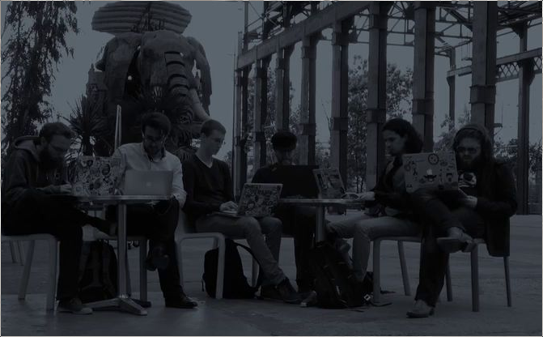

% From PHP to Scala
% Clément Delafargue
% scala.io 2014-10-23

-------------------------------------------

-------------------------------------------

λ

# Back in the 00s

# I was a PHP developer
<video src="../../stuff-indexes/lol/elephant-beach.webm" autoplay loop/>

# Why leave PHP
<video src="../../stuff-indexes/lol/elephant-skydiving.webm" autoplay loop/>

# No types
<video src="../../stuff-indexes/lol/shape-toy.webm" autoplay loop/>

# HTTP is hidden
<video src="../../stuff-indexes/lol/no-idea.webm" autoplay loop/>

# Simplicity is valued

# But PHP is awfully complex
<video src="../../stuff-indexes/lol/rube-goldberg.webm" autoplay loop/>

# What PHP did well
<video src="../../stuff-indexes/lol/elephant-ribbon.webm" autoplay loop/>

# Values Simplicity

# Stateless
<video src="../../stuff-indexes/lol/chain.webm" autoplay loop/>

# Request - response cycle
<video src="../../stuff-indexes/lol/chain.webm" autoplay loop/>

# Alien in a Java world
<video src="../../stuff-indexes/lol/garbage.webm" autoplay loop/>

-------------------------------------------

# Play Framework

# Now it's gearing towards complexity
<video src="../../stuff-indexes/lol/homer-car.webm" autoplay loop/>

# Keep it simple

# Libraries, not frameworks
<video src="../../stuff-indexes/lol/hair-cow.webm" autoplay loop/>

# HTTP layer, not more
<video src="../../stuff-indexes/lol/hamster-tube.webm" autoplay loop/>

# Don't try to hide complexity
<video src="../../stuff-indexes/lol/exploding-poo.webm" autoplay loop/>
